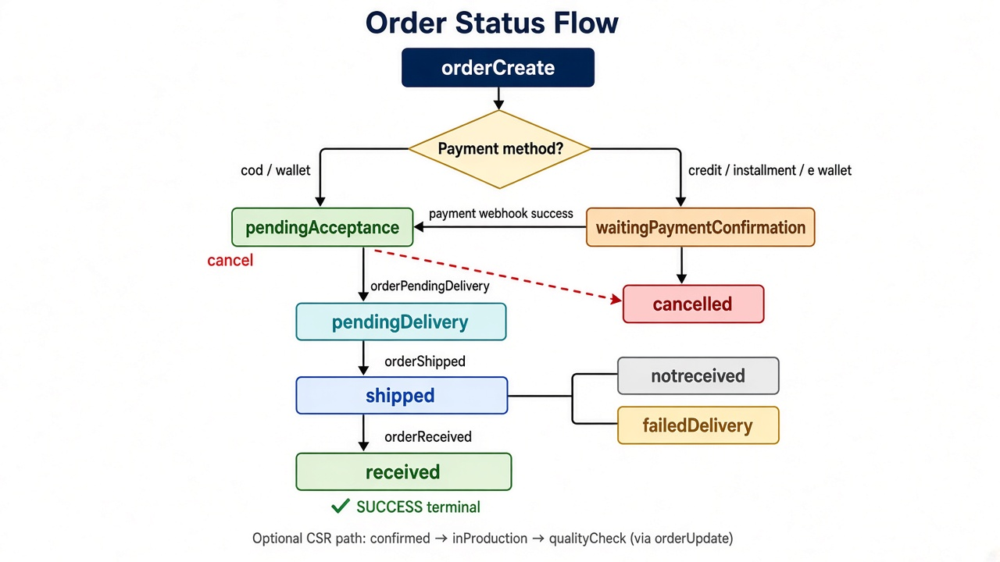
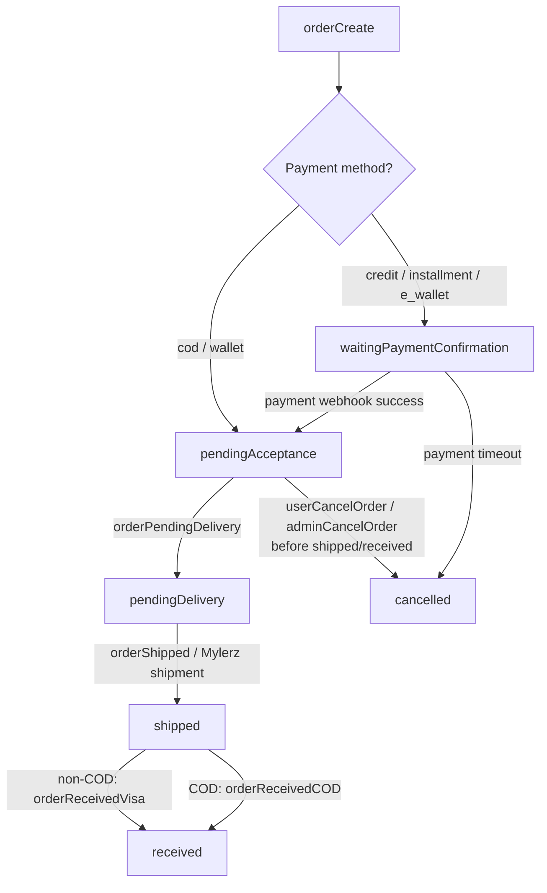
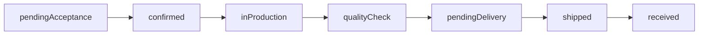
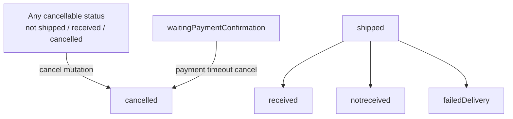

# Order Status Flow



Complete lifecycle of `orderStatus` from order creation to terminal states, based on the current backend behavior.

Related fields (tracked separately):

- `orderStatus` — fulfillment / delivery lifecycle
- `financialStatus` — payment / refund lifecycle
- item-level `items[].status` — per-line item state

---

## 1. Status catalog (`OrderStatusEnum`)

| Status | Meaning |
|---|---|
| `waitingPaymentConfirmation` | Gateway payment started; waiting for webhook confirmation |
| `pendingAcceptance` | Order placed / payment confirmed; awaiting ops acceptance for delivery |
| `confirmed` | Order confirmed *(enum + timeline; usually set via `orderUpdate`)* |
| `inProduction` | Order in production *(enum + timeline; usually set via `orderUpdate`)* |
| `qualityCheck` | Quality check *(enum + timeline; usually set via `orderUpdate`)* |
| `pendingDelivery` | Packed / ready to ship |
| `shipped` | Handed to carrier / shipped |
| `received` | Delivered and received (happy-path terminal) |
| `notreceived` | Marked as not received |
| `failedDelivery` | Delivery attempt failed |
| `cancelled` | Order cancelled (terminal) |

---

## 2. Automated happy path (enforced in code)

This is the path the dedicated mutations / services actually enforce today:



### Step-by-step

1. **Create**
   - `cod` or `wallet` → `pendingAcceptance`
   - `credit` / `installment` / `e_wallet` → `waitingPaymentConfirmation`
2. **Payment webhook** (gateway only)  
   `waitingPaymentConfirmation` → `pendingAcceptance`
3. **Accept for delivery** (`orderPendingDelivery`)  
   `pendingAcceptance` → `pendingDelivery`
4. **Ship** (`orderShipped` / Mylerz)  
   `pendingDelivery` → `shipped`
5. **Receive**
   - Non-COD (`orderReceivedVisa`) → `received`
   - COD (`orderReceivedCOD`) → `received` and `financialStatus = paid`

---

## 3. Designed / CSR path (enum statuses)

These statuses exist in the schema and storefront timeline mapping. They are **not** enforced by the automated transitions above. In practice they are typically applied with `orderUpdate`:



> Note: `orderPendingDelivery` currently jumps directly from `pendingAcceptance` to `pendingDelivery`, skipping `confirmed` / `inProduction` / `qualityCheck`.

---

## 4. Side / terminal paths



### Cancel rules (current code)

Cancel is **blocked** when `orderStatus` is:

- `shipped`
- `received`
- `cancelled`

Cancel is allowed earlier (e.g. `pendingAcceptance`, `pendingDelivery`, production statuses), subject to payment-method handling in `orderCancel`.

### Return flow

Returns start only when the order is already `received` (return request services check this). Return request status is a **separate** lifecycle from `orderStatus`.

---

## 5. Transition matrix (code-enforced)

| From | To | Trigger |
|---|---|---|
| *(create)* | `pendingAcceptance` | `orderCreate` with `cod` / `wallet` |
| *(create)* | `waitingPaymentConfirmation` | `orderCreate` with gateway methods |
| `waitingPaymentConfirmation` | `pendingAcceptance` | payment webhook success |
| `waitingPaymentConfirmation` | `cancelled` | payment timeout cancel |
| `pendingAcceptance` | `pendingDelivery` | `orderPendingDelivery` |
| `pendingDelivery` | `shipped` | shipment services |
| `shipped` | `received` | `orderReceivedVisa` / `orderReceivedCOD` |
| cancellable statuses | `cancelled` | `userCancelOrder` / `adminCancelOrder` |

Optional / manual (via `orderUpdate`, not dedicated transition APIs):

| From (typical) | To |
|---|---|
| `pendingAcceptance` | `confirmed` |
| `confirmed` | `inProduction` |
| `inProduction` | `qualityCheck` |
| `qualityCheck` | `pendingDelivery` |
| `shipped` | `notreceived` / `failedDelivery` |

---

## 6. Financial status (separate track)

`financialStatus` moves independently of fulfillment:

| Value | Typical meaning |
|---|---|
| `unpaid` | Not paid yet |
| `pending` | Payment pending |
| `partialPaid` | Partial wallet / partial gateway amount |
| `paid` | Fully paid |
| `pendingRefund` | Refund initiated (e.g. visa cancel) |
| `partialRefund` | Partial refund |
| `refunded` | Fully refunded |

Example overlap with order status:

- COD: often `shipped` + unpaid/pending money → on receive becomes `received` + `paid`
- Gateway: often becomes `paid` at webhook, then fulfillment continues (`pendingAcceptance` → … → `received`)
- Cancel after paid visa: may move financial status to `pendingRefund` / `refunded` while order becomes `cancelled`

---

## 7. Quick reference — linear automated flow

```text
[Gateway]
orderCreate
  → waitingPaymentConfirmation
  → pendingAcceptance          (webhook)
  → pendingDelivery            (orderPendingDelivery)
  → shipped                    (shipment)
  → received                   (orderReceived*)

[COD / Wallet]
orderCreate
  → pendingAcceptance
  → pendingDelivery
  → shipped
  → received

[Cancel branch]
any cancellable status → cancelled

[Delivery exceptions]
shipped → notreceived | failedDelivery
```

---

## Source references

- Enum: `src/api/order/types/orderEnums.js`
- Model defaults: `src/database/models/order.js`
- Create initial status: `src/services/order/orderCreator.js`
- Payment webhook: `src/services/order/handleOrderPaymentWebhook.js`
- Pending delivery / received: `src/services/order/orderStatus.js`
- Shipment: `src/services/order/orderShipment.js`, `orderShipmentMylerz*.js`
- Cancel: `src/services/order/orderCancel.js`
- Timeline mapping: `src/services/order-timeline/storefrontTimelineMapping.js`
